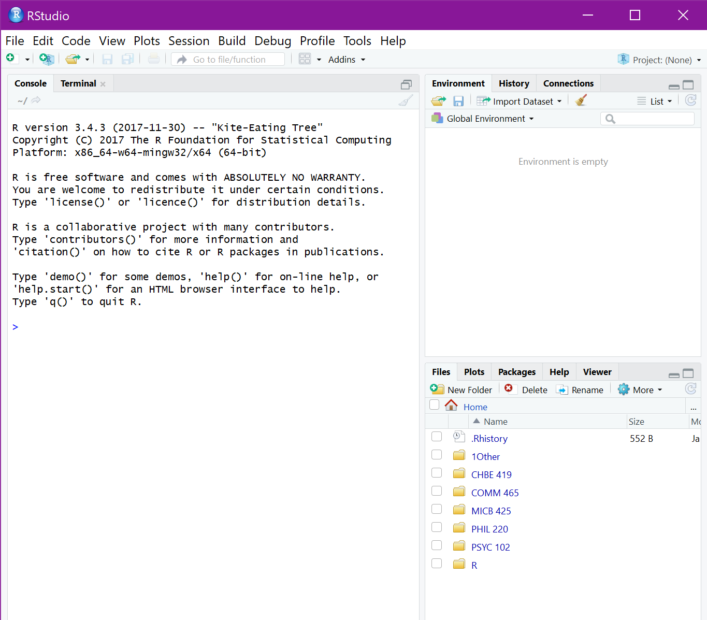

# Module 01

## Module 01 portfolio check
* Installation check
    + Completion status:
    + Comments:
* Portfolio repo setup
    + Completion status: 
    + Comments:
* RMarkdown Pretty html Challenge
    + Completion status:
    + Comments:
* Evidence worksheet_01
    + Completion status:
    + Comments:
* Evidence worksheet_02
    + Completion status:
    + Comments:
* Evidence worksheet_03
    + Completion status:
    + Comments:
* Problem Set_01
    + Completion status:
    + Comments:
* Problem Set_02
    + Completion status:
    + Comments:
* Writing assessment_01
    + Completion status:
    + Comments:
* Additional Readings
    + Completion status:
    + Comments  
    
## Data science Friday  

### Installation check
{width=50%}  

{width=50%}  

{width=50%}  

### Portfolio repo setup
1) To create my portfolio:  
  `mkdir MICB245_portfolio`

2) To initalize my portfolio:  
a) Created a repository called MICB425_portfolio on GitHub GUI  
b) Return to terminal:  
  `cd ~/Documents/MICB425_portfolio`  
  `git init`  
  
3) To push my portfolio to GitHub:  
  `git add .`  
  `git commit -m "message"`  
  `git status`   
  `git push`


### RMarkdown pretty html challenge
*Note: Assignment headers have '.' in front of them so as not to clutter the portfolio headings.  
.# R Markdown PDF Challenge  
The following assignment is an exercise for the reproduction of this .html document using the RStudio and RMarkdown tools we've shown you in class. Hopefully by the end of this, you won't feel at all the way this poor PhD student does. We're here to help, and when it comes to R, the internet is a really valuable resource. This open-source program has all kinds of tutorials online.


.##Challenge Goals  
The goal of this R Markdown html challenge is to give you an opportunity to play with a bunch of different RMarkdown formatting. Consider it a chance to flex your RMarkdown muscles. Your goal is to write your own RMarkdown that rebuilds this html document as close to the original as possible. So, yes, this means you get to copy my irreverant tone exactly in your own Markdowns. It's a little window into my psyche. Enjoy =)

**hint: go to the [PhD Comics website](http://phdcomics.com/) to see if you can find the image above**  
*If you can't find that exact image, just find a comparable image from the PhD Comics website and include it in your markdown*

.### Here's a header!  
Let's be honest, this header is a little arbitrary. But show me that you can reproduce headers with different levels please. This is a level 3 header, for your reference (you can most easily tell this from the table of contents).

.####Another header, now with maths  
Perhaps you're already really confused by the whole markdown thing. Maybe you're so confused that you've forgotten how to add. Never fear! ~~A calculator~~ R is here:  

``` {r}
1231521+12341556280987
```

.### Table Time  
Or maybe, after you've added those numbers, you feel like it's about time for a table!  
I'm going to leave all the guts of the coding here so you can see how libraries (R packages) are loaded into R (more on that later). It's not terribly pretty, but it hints at how R works and how you will use it in the future. The summary function used below is a nice data exploration function that you may use in the ^future^.

```{r}
library(knitr)
kable(summary(cars),caption="I made this table with kable in the knitr package library")
```

And now you've almost finished your first RMarkdown! Feeling excited? We are! In fact, we're so excited that maybe we need a big finale eh? Here's ours! Include a fun gif of your choice!  
{width=50%}

### Assignment 4  
See R script "DS_assignment4_19163147" in portfolio repo

## Origins and Earth Systems
### Evidence worksheet 01 
[Whitman *et al* 1998](https://www.ncbi.nlm.nih.gov/pmc/articles/PMC33863/)

#### Learning objectives
Describe the numerical abundance of microbial life in relation to ecology and biogeochemistry of Earth systems. 

#### General questions
* What were the main questions being asked?  
**How many prokaryotes are present? How much carbon do they produce?**  

* What were the primary methodological approaches used?  
**In aquatic environments, they measured cellular density in cells/mL. In soil, they estimated abundance from unpublished field studies. For subsurface environments, they used two different methods. They either estimated from groundwater data or calculated number of prokaroytes based on the assumptions that average porosity is 3% as well as the average estimated volume of a prokaryotic cell.**  

* Summarize the main results or findings.  
**The total number of prokaryotes is 4-6 x 10^30^. The total cellular carbon on Earth is 350-550 Pg (so prokaryotic carbon is 60-100% of the estimated carbon in plants) and there is 10-fold more nitrogen and phosphorus in prokaryotes than plants. Most prokaryotes are found in open ocea, soil, and oceanic/terrestrial subsurfaces. Prokakryotic cellular production rate is the highest in the open ocean, and their large population size mixed with rapid growth allows for vast genetic diversity.**  

* Do new questions arise from the results?  
**How does the mutation rate affect global cycles? How does turnover rate correlate with mutation rates? How many prokaryotes are in the less-explored areas that were briefly mentioned in the paper?**  

* Were there any specific challenges or advantages in understanding the paper (*e.g.* did the authors provide sufficient background information to understand experimental logic, were methods explained adequately, were any specific assumptions made, were conclusions justified based on the evidence, were the figures or tables useful and easy to understand)?  
**They presented enough evidence in the paper to supplement the conclusion. The methods could have been a bit more descriptive, especially with the calculations. There could have been more justification in how the calculations were made.**


### Problem set 01
[Whitman *et al* 1998](https://www.ncbi.nlm.nih.gov/pmc/articles/PMC33863/)  

#### Learning objectives: 
Describe the numerical abundance of microbial life in relation to the ecology and biogeochemistry of Earth systems.

#### Specific questions:
* What are the primary prokaryotic habitats on Earth and how do they vary with respect to their capacity to support life? Provide a breakdown of total cell abundance for each primary habitat from the tables provided in the text.  
**Aquatic: 1.181 x 10^29^ cells**  
**Soil: 2.556 x 10^29^ cells**    
**Subsurface: 3.8 x 10^30^ cells**   

* What is the estimated prokaryotic cell abundance in the upper 200 m of the ocean and what fraction of this biomass is represented by marine cyanobacterium including Prochlorococcus? What is the significance of this ratio with respect to carbon cycling in the ocean and the atmospheric composition of the Earth?  
**Estimated cell abundance = 360 x 10^26^**  
***Prochlorococcus* = 8% --> 28.8 x 10^26^**  
**Significance for carbon cycling = 8% of upper 200m can photosynthesize --> upper ocean is ideal place for them to be so they can access sunlight**  

* What is the difference between an autotroph, heterotroph, and a lithotroph based on information provided in the text?  
**Autotroph = "self-nourishing"; fix inorganic carbon (eg. CO~2~) into biomass**  
**Heterotroph = consumes and metabolizes inorganic carbon (assimilates inorganic carbon)**  
**Lithotroph = breaks down inorganic substrates**  

* Based on information provided in the text and your knowledge of geography what is the deepest habitat capable of supporting prokaryotic life? What is the primary limiting factor at this depth?  
**Deepest habitat: 4km subsurface sediments (terrestrial, probably marine as well)**  
**Limiting factor: temperaure (125 degrees Celcius; about 22 degrees/km)**  
**Mariana's Trench is 10.9 km, so deepest habitat is probably ~15km**  

* Based on information provided in the text your knowledge of geography what is the highest habitat capable of supporting prokaryotic life? What is the primary limiting factor at this height? 
**Mount Everest is 8.8km**  
**There are spore-forming bacteria 57-77km in the air**  
**Limiting factor: resources, ionizing UV radiation, lack of moisture, bad weather conditions**  
**- so there are probably no microbes actually metabolizing up there, just transporting**  
**We can estimate 20 km to be conservative, so highest is 29 km**  

* Based on estimates of prokaryotic habitat limitation, what is the vertical distance of the Earth's biosphere measured in km?  
**24 km (Mount Everest to 4 km below Mariana's Trench)**

* How was annual cellular production of prokaryotes described in Table 7 column four determined? (Provide an example of the calculation)  
**The turnover time in days is converted to years. Then, the population size is divided by the turnover rate in years.**  
*(16 days)/(365 days/year) = 0.0438 years*  
*(3.6 x 10^28^ cells)/(0.0438 years) = 8.2 x 20^29^ cells/year*

* What is the relationship between carbon content, carbon assimilation efficiency and turnover rates in the upper 200m of the ocean? Why does this vary with depth in the ocean and between terrestrial and marine habitats?  
**Carbon efficiency/growth efficiency is 20% --> they used a 4 multiplier instead of 5 (how well an organism can assimilate carbon into biomass)**  
*20fg of carbon in a prokaryotic cell --> 20^-30^ Pg/cell*  
*3.6 x 10^28^ cells x 20^-30^ Pg/cell = 0.72 Pg of C in marine heterotrophs*  
*4 x 0.72 Pg C = 2.88 Pg C/year*  
*51 Pg C/year x 0.85 (85% consumed) = 43 Pg C/year*  
*(43 Pg C/year)/(2.88 Pg C/year) = 14.9/year turnovers* OR ***1 turnover every 24.5 days* **    
**Contrasting the amount of carbon that is produced and consumed in different parts of the biosphere**  

* How were the frequency numbers for four simultaneous mutations in shared genes determined for marine heterotrophs and marine autotrophs given an average mutation rate of 4 x 10^-7^ per DNA replication? (Provide an example of the calculation with units. Hint: cell and generation cancel out)  
**The mutation rate was calulcated to the power of 4 (for 4 simultaneous mutations. Then, the total number of cells was multipled by the turnover rate to calculate cells/year. That value was multiplied by the simultaneous mutation rate to give us the number of mutations per year.**  
*4 x 10^-7^ mutations/generation*   
*(4 x 10^-7^)^4^ = 2.56 x 10^-26^ mutations/generation*  
*365/16 turnovers = 22.8 turnovers/year*  
*3.6 x 10^28^ cells x 22.8 turnovers/year = 8.2 x 10^29^ cells/year*  
*(8.2 x 10^29^ cells/year) x (2.56 x 10^-26^ mutations/generation) = 2.1 x 10^4^ mutations/year --> 0.4 hours/mutation*  

* Given the large population size and high mutation rate of prokaryotic cells, what are the implications with respect to genetic diversity and adaptive potential? Are point mutations the only way in which microbial genomes diversify and adapt?  
**Since prokaryotes have high mutation rates in such a large population, they are bound to get numerous mutations that end up persisting in the population. This leads to genetic diversity as different mutations accumulate, resulting in different strains and species. Genomes can also diversify and adapt with horizontal gene transfer.**  

* What relationships can be inferred between prokaryotic abundance, diversity, and metabolic potential based on the information provided in the text?   
**The relationship between these three can be seen as cyclic. Prokaryotes are so abundant because of their rapid growth rate and ability to survive in harsh conditions due to the amount of metabolic processes they can carry out. Because they are so abundant with a rapid growth rate, this leads to genetic diversity, which results in prokaryotes that can perform many different metabolic reactions. The fact that they have so much metabolic potential allows their abundance to continue.**  


### Module 01 references
Whitman WB, Coleman DC, and Wiebe WJ. 1998. Prokaryotes: The unseen majority. Proc Natl Acad Sci USA. 95(12):6578-6583.  [PMC33863](https://www.ncbi.nlm.nih.gov/pmc/articles/PMC33863/)